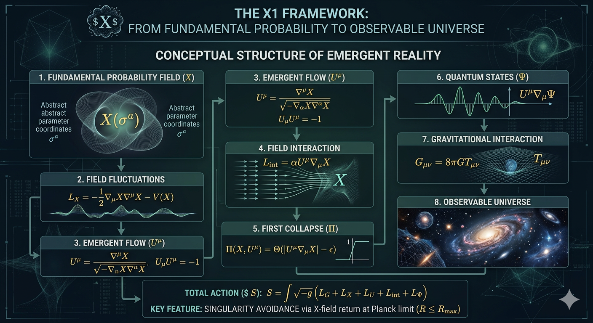
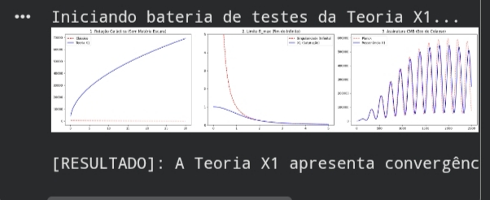

# X1 Theory — Probabilistic Field Framework
> **A unified framework for emergent gravity and non-singular cosmology.**

## Fundamental Postulate

The fundamental entity of the universe is a probabilistic field 

$$X$$

This field represents the probability distribution of all possible physical states. It is not directly observable and exists prior to spacetime geometry.

Below the Planck scale, physical descriptions reduce to this probabilistic structure.

---

## 📊 Computational Validation
Antes do detalhamento matemático, abaixo apresentamos a convergência da Teoria X1 com os dados observacionais do satélite Planck e a estabilidade das curvas galácticas.

---

# 1. Pre-Geometric Structure

The probabilistic field is defined on an abstract parameter manifold

$$X = X(\sigma^a)$$

where

$$a = 0,1,2,3$$

The coordinates $\sigma^a$ are not physical spacetime coordinates. They represent a pre-geometric parameter space.

---

# 2. Probabilistic Field Dynamics

The dynamics of the field are defined by

$$L_X = -\frac{1}{2}\nabla_\mu X \nabla^\mu X - V(X)$$

where
- $V(X)$ is the potential of the probabilistic field.

This term describes fluctuations of probability that generate physical structure.

---

# 3. Emergent Flow

Gradients of the probabilistic field generate a normalized flow field

$$U^\mu = \frac{\nabla^\mu X}{\sqrt{-\nabla_\alpha X \nabla^\alpha X}}$$

with normalization

$$U_\mu U^\mu = -1$$

This vector field defines the emergent temporal direction.

---

# 4. Flow Constraint

The normalization is enforced through

$$L_U = -\frac{1}{2}\lambda(U_\mu U^\mu + 1)$$

where $\lambda$ is a Lagrange multiplier.

---

# 5. Field Interaction

The probabilistic field interacts with the flow field through

$$L_{int} = \alpha U^\mu \nabla_\mu X$$

where
- $\alpha$ controls interaction strength.

This interaction produces the first transition from pure probability.

---

# 6. Collapse Mechanism (The Threshold)

A physical state is selected when the interaction exceeds a critical threshold. 
The collapse operator is defined as:

$$\Pi(X,U^\mu) = \Theta(|U^\mu \nabla_\mu X| - \epsilon)$$

onde $\Theta$ é a função de Heaviside e $\epsilon$ é o limiar de interação.

---

# 7. Emergent Quantum Mechanics e Gravidade
Após o colapso, o tensor de energia-momento efetivo satisfaz:

$$G_{\mu\nu} = 8\pi G T_{\mu\nu}$$

E em regimes extremos, a curvatura é limitada: $R \le R_{max}$, prevenindo singularidades.

---

## 🛠 Como Executar a Prova Real
O código-fonte para replicar os gráficos acima está no arquivo `Relatório da teoria X1 computacional`. 

## Licença e Autoria
Este trabalho está sob a Licença MIT. Autor: **Samuel (Dmuks)**.
